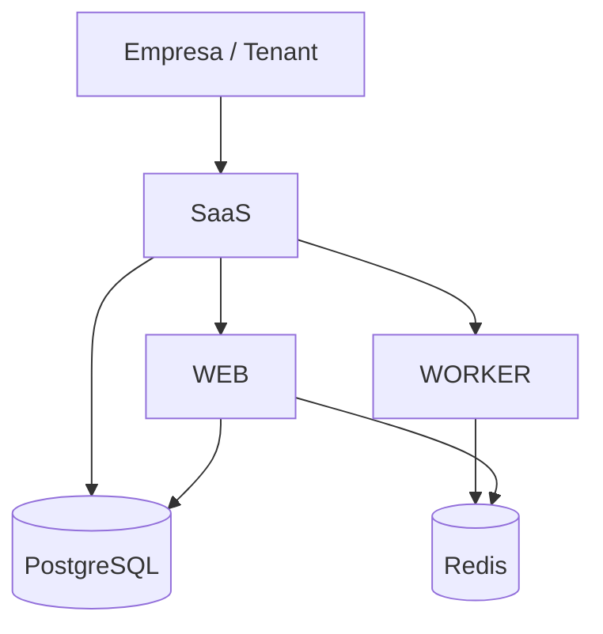
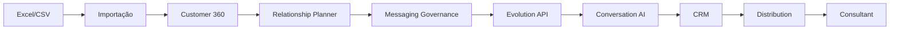

# Architecture Context

```mermaid
flowchart TD
  T[Empresa / Tenant] --> S[SaaS]
  S --> W[WEB]
  S --> WK[WORKER]
  S --> DB[(PostgreSQL)]
  WK --> R[(Redis)]
  W --> DB
  W --> R
```

## Future product flow

```mermaid
flowchart LR
  A[Excel/CSV] --> B[Importação] --> C[Customer 360] --> D[Relationship Planner]
  D --> E[Messaging Governance] --> F[Evolution API] --> G[Conversation AI]
  G --> H[CRM] --> I[Distribution] --> J[Consultant]
```
