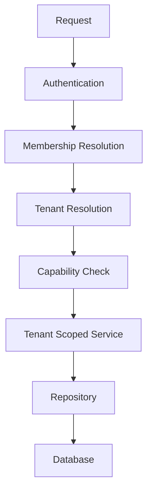

# Identity

Authentication uses an opaque random session token. Only its SHA-256 digest is stored. Passwords use Node.js `scrypt` with a unique random salt. Login rotates all previous sessions, applies a Redis-backed rate limit, returns generic failures, and sets an `httpOnly`, `sameSite=lax` cookie that is `secure` in production.

Invites use 256-bit random, single-use, expiring tokens stored only as hashes. Until email delivery exists, the create-user response returns the token once to the authorized administrator.

Multiple memberships require an explicitly selected tenant validated by `/api/tenant/select`; a single active membership is selected automatically. `/platform` uses a separate platform-admin guard.
