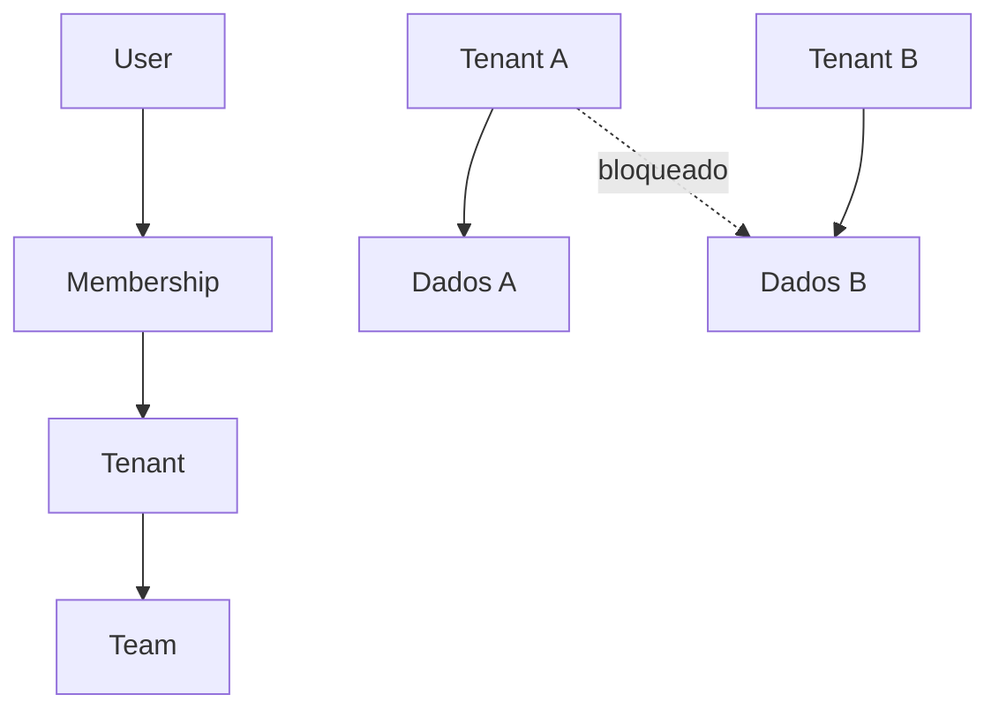

# Multi-tenancy

Every tenant-owned query receives `AuthorizationContext.tenantId` and applies it in the database predicate. Request headers may propose a tenant, but membership resolution must authorize it first. Team membership also has a composite `(teamId, tenantId)` foreign key.

Hard deletes are not the default. Tenant, membership, team, audit and outbox relations use restrictive foreign keys to preserve history.
