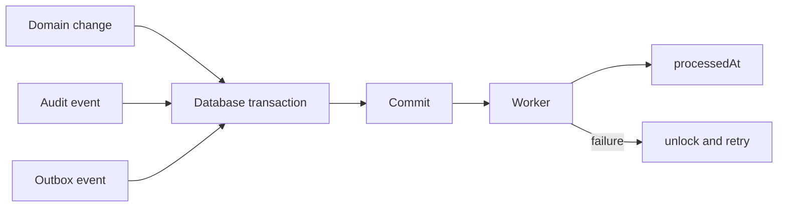

# Transactional outbox

Domain changes, audit records and `OutboxEvent` rows commit in one transaction. The worker claims pending rows with a conditional update, increments attempts, processes each event once, and records `processedAt`. Failures clear the lock and store a bounded error for retry.

